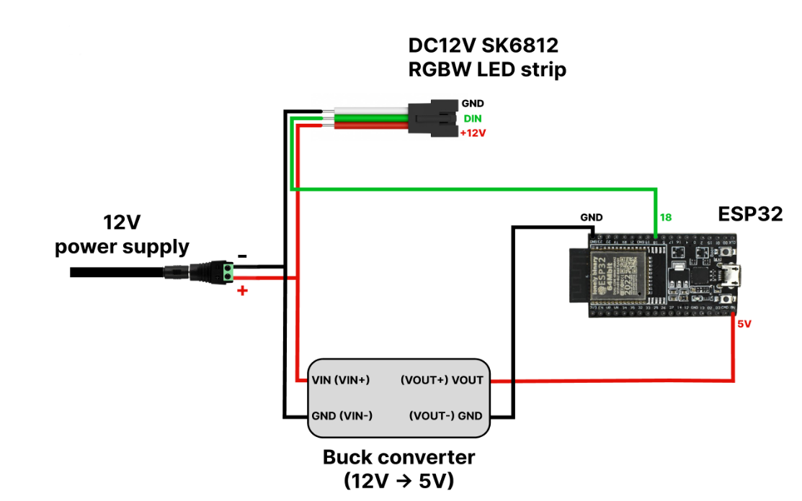

# ESP32 BLE RGBW LED Controller

A complete wireless RGBW lighting control system combining an ESP32 firmware with an Android application for real-time control of SK6812 RGBW LEDs.

The system supports Bluetooth control, smooth RGBW transitions, animated lighting effects, color palettes, brightness and speed adjustment, an auto-off timer, and persistent configuration.

## Project Overview

This project was developed as a complete embedded and mobile control solution for an SK6812 RGBW LED installation.

The system combines:

* ESP32 microcontroller
* SK6812 RGBW LED strip
* Android control application
* Bluetooth communication
* 12 V LED power system
* 12 V → 5 V buck-converter stage for the ESP32

The firmware was initially developed and tested using an ESP32 and Serial Monitor before being deployed to the client's ESP32 and validated with the physical LED installation.

The client's LED strip was arranged as a ring for the final installation.

## System Architecture

```text
┌─────────────────────────┐
│      Android App        │
│                         │
│  • Power                │
│  • Colors               │
│  • Brightness           │
│  • Speed                │
│  • Effects              │
│  • Palettes             │
│  • Timer                │
└────────────┬────────────┘
             │
        Bluetooth
             │
             ▼
┌─────────────────────────┐
│          ESP32          │
│                         │
│  • Command handling     │
│  • RGBW control         │
│  • Fade engine          │
│  • LED effects          │
│  • Timer management     │
│  • State persistence    │
└────────────┬────────────┘
             │
          GPIO 18
             │
             ▼
┌─────────────────────────┐
│     SK6812 RGBW LEDs    │
│                         │
│       R  G  B  W        │
└─────────────────────────┘
```

## Hardware

| Component         | Purpose                                      |
| ----------------- | -------------------------------------------- |
| ESP32             | Main microcontroller and Bluetooth interface |
| SK6812 RGBW LEDs  | Individually controllable RGBW pixels        |
| 12 V power supply | Main LED power source                        |
| Buck converter    | Steps 12 V down to 5 V for the ESP32         |
| Breakout board    | Mounting and wiring organization             |

### LED Configuration

The firmware uses a configurable LED count. The client's working prototype was configured for 12 LEDs, while the original project requirements targeted larger installations of up to 300+ LEDs.

The LED strip was arranged as a ring in the client's physical installation.

### LED Data

* Data GPIO: GPIO18
* Pixel type: RGBW
* Protocol: 800 kHz
* Library: Adafruit NeoPixel

## Wiring

The power architecture uses a 12 V supply for the LED strip and a buck converter to provide 5 V to the ESP32.

The ESP32 and LED strip share a common ground.

The LED data signal is connected to GPIO18.



## Firmware Features

### Bluetooth Command Interface

The Android application sends structured commands to the ESP32 over Bluetooth.

Examples include:

```text
POWER:ON
POWER:OFF
COLOR:RED
COLOR:BLUE
BRIGHTNESS:75
SPEED:50
EFFECT:SHIFT
EFFECT:CHASE
PALETTE:OCEAN
TIMER:START:900000
TIMER:STOP
TIMER:CANCEL
REQUEST:STATE
```

The firmware parses incoming commands and dispatches them to the corresponding control functions.

### Pure White RGBW Mode

The system uses the dedicated white channel of the SK6812 RGBW LEDs for pure white output instead of producing white by mixing RGB channels.

### Smooth RGBW Transitions

The firmware implements smooth transitions between colors using RGBW interpolation rather than abrupt color changes.

The system also supports smooth fade-in and fade-out behavior.

### Lighting Effects

#### Color Shift

The Color Shift effect cycles through predefined colors and smoothly transitions from one color to the next.

#### Color Chase

The Color Chase effect creates a moving RGBW pattern across the LED strip using grouped colors and interpolation.

The animation speed can be adjusted through the application.

### Color Palettes

The firmware includes predefined palettes including:

* Sunset
* Ocean
* Forest
* Rainbow

### Brightness & Speed Control

Brightness and animation speed can be adjusted dynamically from the Android application.

### Auto-Off Timer

The system supports a configurable auto-off timer.

When the timer expires, the firmware performs a fade-out before turning the LEDs off.

### Persistent State

The ESP32 Preferences system stores controller settings including:

* Power state
* Color
* Palette
* Effect
* Brightness
* Speed

This allows the controller to retain its configuration between power cycles.

## Android Application

The Android application provides the wireless user interface for controlling the ESP32.

### Main Controls

* Power ON/OFF
* Solid color selection
* Pure white mode
* Brightness adjustment
* Effect selection
* Effect speed
* Color palettes
* Auto-off timer
* Bluetooth connection/status

### Application Screenshots


## Demo

The demonstration video shows the Android application communicating with the ESP32 over Bluetooth and the corresponding commands being received and processed by the firmware.

The demonstration includes:

* Android control interaction
* Bluetooth communication
* Command reception
* Serial Monitor feedback
* Different application controls and their corresponding firmware responses

**Demo:** `demo/android-esp32-demo.mp4`

## Hardware Validation

Development was initially performed with an ESP32 and Serial Monitor because the LED hardware was not locally available during the first stage of development.

The firmware was subsequently deployed to the client's ESP32 and tested with the actual SK6812 RGBW LED installation.

The system went through multiple firmware iterations based on physical testing and client feedback, including improvements to:

* Fade-in behavior
* Fade-out behavior
* Color transitions
* Color Chase movement
* State persistence
* Startup behavior
* Bluetooth/application interaction

The final system was validated on the target ESP32 and physical LED installation.

## Selected Implementation

Selected firmware excerpts are included in the `examples/` directory to demonstrate the engineering approach without publishing the complete project implementation.

The examples cover:

* Bluetooth command handling
* RGBW color interpolation
* Animated Color Chase logic
* Persistent controller state

The complete project source code and complete Android application source are not included in this public portfolio repository.

## Engineering Highlights

### Embedded Firmware

* ESP32
* Arduino/C++
* Adafruit NeoPixel
* RGBW LED control
* Bluetooth command processing
* Non-blocking timing using `millis()`
* Persistent state storage
* Timer management

### Lighting Algorithms

* RGBW interpolation
* Smooth fade transitions
* Easing functions
* Moving color groups
* Palette generation
* Rainbow color conversion

### Mobile Integration

* Android control interface
* Bluetooth communication
* Structured command protocol
* Real-time parameter control
* Controller state feedback

### System Integration

* Mobile application
* Wireless communication
* Embedded firmware
* RGBW LED hardware
* Power architecture
* Debugging and iterative hardware validation

## Technologies

**Microcontroller:** ESP32

**Programming:** C/C++ / Arduino

**Wireless:** Bluetooth

**Mobile:** Android

**LED:** SK6812 RGBW

**LED Library:** Adafruit NeoPixel

**Persistent Storage:** ESP32 Preferences

**Development & Testing:** Arduino IDE, ESP32 Serial Monitor

## My Contribution

I developed the embedded firmware and Android control application, designed the communication flow between the mobile application and ESP32, implemented RGBW lighting effects and smooth transition algorithms, integrated brightness, speed, timer and persistent-state functionality, performed firmware-level testing, and supported the client's physical hardware deployment and validation.

The project was developed iteratively based on testing and client feedback.

## Documentation

The complete project documentation is available in:

`docs/project-documentation.pdf`

